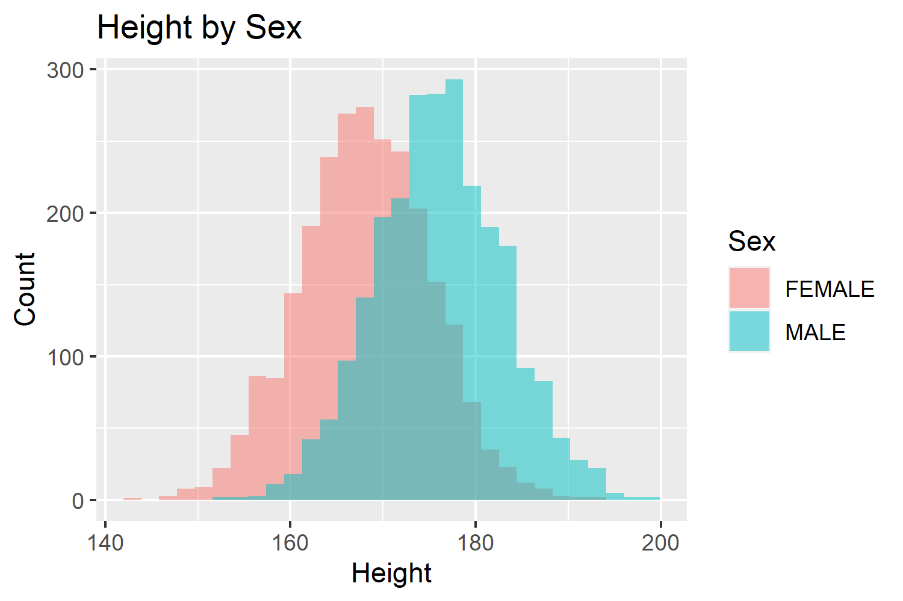

```{r setup, include=FALSE}
knitr::opts_chunk$set(echo = TRUE)
```

# Introduction

This is an R Markdown document. Here we simulate height data for males and females, and then plot the data in a histogram.

## Simulate and plot data
```{r, eval=T, warning=F, message=F, results='hide'}
setwd("C:/Users/Rodrigo/Dropbox/Downloads/Oliver Pain - practical materials/demo/website")
# Simulate height data for 500 males and females
n<-5000
set.seed(5123)
sim_dat<-data.frame(ID=1:n,
                    Sex=c(rep('MALE',n/2), rep('FEMALE', n/2)),
                    Height=c(rnorm(n/2, 176, 7),rnorm(n/2, 168, 7)))

# Load libraries
library(ggplot2)

# Plot data
test_plot<-ggplot(sim_dat, aes(x=Height, fill=Sex)) +
              geom_histogram(alpha=0.5, position="identity") +
              labs(y='Count', title='Height by Sex')

# Create .png
png('test_plot.png', 
    units='px', res=300, width=1500, height=1000)
test_plot
dev.off()

```


